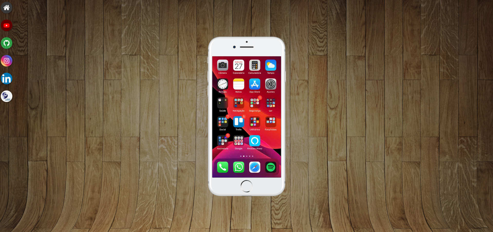
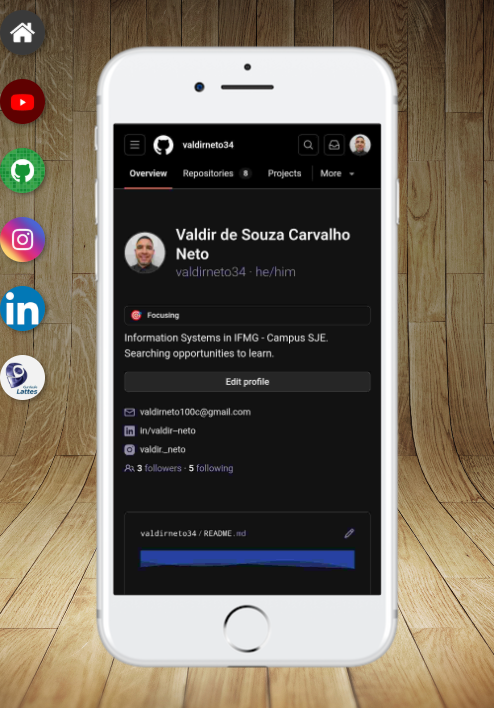
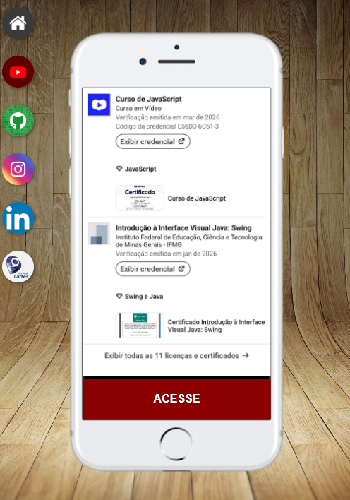
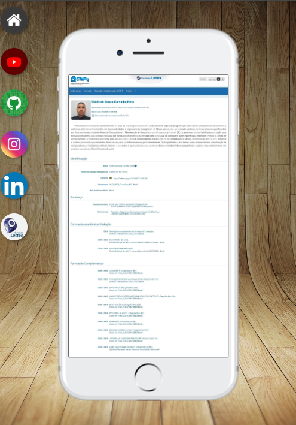
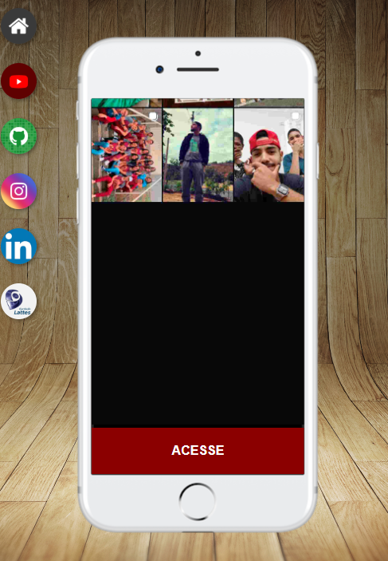

# 📱 Projeto Redes Sociais (Smart Hub)

Este projeto é um hub de links interativo que simula a interface de um smartphone. O objetivo principal é centralizar o acesso às principais redes sociais, portfólios e currículos em uma única página estilizada e dinâmica.

Este foi um projeto bastante desafiador e recompensador, exigindo um controle preciso de posicionamento CSS e o uso avançado de frames embutidos (`iframe`) para criar uma experiência de navegação contínua.

---

## 🚀 Tecnologias e Desafios Técnicos

O diferencial deste projeto não está apenas na estética, mas na mecânica de navegação. A página principal não recarrega ao alternar entre as redes sociais. Isso foi alcançado através das seguintes práticas:

* **Integração com `<iframe>`:** O "visor" do celular é um iframe (`<iframe name="tela">`). Todos os botões laterais utilizam o atributo `target="tela"`, fazendo com que os sub-documentos carreguem exclusivamente dentro da tela do aparelho.
* **Posicionamento Absoluto e Centralização:** O contêiner do smartphone foi perfeitamente centralizado na tela utilizando a técnica clássica de CSS com `position: absolute`, `top: 50%`, `left: 50%` e `transform: translate(-50%, -50%)`.
* **Animações e Microinterações:** Os ícones das redes sociais ganharam vida através de pseudo-classes (`:hover`). Foi aplicado um efeito de elevação suave utilizando `transform: translate(-3px, -3px)`, combinado com transições (`transition`) e manipulação de sombras (`box-shadow`), melhorando significativamente a usabilidade.
* **Manipulação de Scrollbars:** Utilização do pseudo-elemento `::-webkit-scrollbar` para ocultar a barra de rolagem nativa do navegador dentro do iframe, mantendo a ilusão de um aplicativo mobile nativo limpo.

---

## 📂 Estrutura do Projeto

O projeto foi componentizado para facilitar a manutenção e organização do código. Cada elemento possui seu escopo bem definido:

* `index.html`: A estrutura principal que segura o background de madeira e a moldura do celular.
* `home.html`: A tela inicial padrão carregada no visor.
* `github.html`, `linkedin.html`, `lattes.html`, `instagram.html`, `youtube.html`: Páginas individuais que exibem a imagem da respectiva rede e o botão de redirecionamento oficial.
* `style.css`: Controla o layout geral, o posicionamento absoluto do aparelho e o comportamento do fundo da página principal.
* `social.css`: Padroniza o visual interno, botões e imagens das páginas que rodam dentro do celular.

---

## 📖 Como visualizar o projeto?

👉 [Clique aqui para acessar o Smart Hub](https://valdirneto34.github.io/Projeto-Social/)

---

## 🛠️ Como rodar localmente?

1. Clone este repositório para a sua máquina executando o comando abaixo no terminal:
   ```bash
   git clone https://valdirneto34.github.io/Projeto-Social/
   ```

---

## 📖 Screenshots do Projeto
   <p align="center">
        
    </p>
   <p align="center">
        
        
    </p>
   <p align="center">
        
        
    </p>
